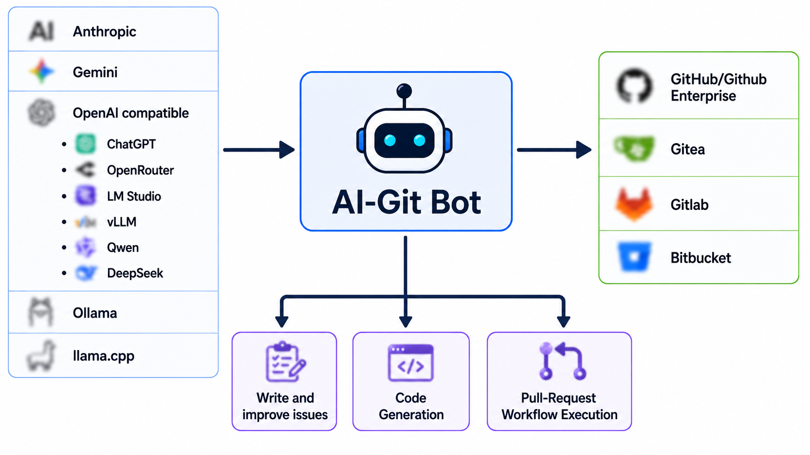

# AI-Git-Bot

[](LICENSE)
[](https://hub.docker.com/r/tmseidel/ai-git-bot)
[](https://github.com/tmseidel/ai-git-bot/releases)
[](https://github.com/tmseidel/ai-git-bot/stargazers)
[](https://github.com/tmseidel/ai-git-bot/issues)

🌐 Languages: **English** · [中文](README.zh.md) · [한국어](README.ko.md) · [日本語](README.ja.md)

> **Automate the necessary-but-uncomfortable parts of software development — directly inside the Git tools your team already uses.**

Every team has a list of *"we know we should be doing this"* engineering chores: writing a properly scoped issue before coding starts, adding a regression test for the bug you just fixed, re-reviewing a PR after the third force-push, tearing down a stale preview environment. These chores are **necessary** but **uncomfortable** — and they get cut first under deadline pressure.

**AI-Git-Bot turns those chores into repeatable, automated workflows** that live natively inside **Gitea, GitHub, GitHub Enterprise, GitLab, and Bitbucket Cloud** — triggered by the events your team is *already* producing (issue assigned, PR opened, reviewer re-requested, `@bot` mentioned in a comment). Self-hostable end-to-end, including local LLMs — nothing has to leave your infrastructure.

> 📣 **New here?** Read **[the pitch](doc/pitch/PITCH.md)** — why this project exists, what it does for your team, and how it compares to Copilot Workspace / GitLab Duo / Qodo / Aider (~10 min read).

<p align="center">
  
</p>

## ✨ What it does

| Workflow | Triggered by | What it produces |
|---|---|---|
| **PR Review** | PR opened with bot as reviewer, or review re-requested | Inline + summary review comments, chunked for large diffs |
| **Interactive Q&A** | `@bot` mention in any PR or inline review comment | Threaded reply with file/diff context and session memory |
| **Issue → Code** (coding agent) | Issue assigned to a *coding* bot | A pull request implementing the change, validated with your project's own build tooling |
| **Issue → Better Issue** (writer agent) | Issue assigned to a *writer* bot | A structured `AI Created Issue` with acceptance criteria |
| **Unit tests** (test author) | PR opened, or `@bot generate-tests` | White-box unit tests for the diff, run with your project's test runner and committed onto the PR branch |
| **Full-stack QA** (E2E tests) | PR opened on a bot with a deployment target | A generated Playwright suite run against a per-PR preview environment, report posted to the PR, teardown on close |

All workflows are **opt-in per bot** — pick the chore that hurts most, wire one bot, done. Nothing changes for repos you don't touch.

> 🎥 **Watch the PR workflows in action:** [AI-Git-Bot — PR workflow walkthrough on YouTube](https://www.youtube.com/watch?v=MjFmZHGIO-w)

<p align="center">
  
</p>

<details>
<summary>📸 Screenshots: reviews, conversations, and coding agents across platforms</summary>

**Gitea:** 

**GitHub:** 

**GitLab:** 

**Bitbucket:** 

**Coding agent (GitHub):** 

</details>

## 🔌 Mix & match any AI provider with any Git platform

AI-Git-Bot is a small, self-hosted **gateway**: configure an AI provider once, attach it to as many bots and repositories as you like. API keys, prompts, and tool whitelists are managed in one admin UI; secrets are encrypted at rest (AES-256-GCM); remote MCP servers can be attached with a per-tool whitelist.

| AI providers | Git platforms |
|---|---|
| **Anthropic** (Claude) | **Gitea** (self-hosted) |
| **OpenAI** (+ OpenAI-compatible APIs) | **GitHub** / **GitHub Enterprise** |
| **Google AI / Gemini** | **GitLab** (gitlab.com & self-managed) |
| **Ollama** (local LLMs) | **Bitbucket Cloud** |
| **llama.cpp** (local GGUF models) | |

> 🧪 **Project maturity:** Gitea and GitHub are well-tested in production use; GitLab and Bitbucket Cloud are experimental (implemented from the official API docs and smoke-tested). The Full-stack QA / E2E workflow is the most complex moving part and should be considered experimental on every provider. **Bug reports are very welcome** — every non-trivial workflow ships with a reproducible `docker-compose` system-test stack; see the [Testing Guide](doc/TESTING_GUIDE.md).

## 🚀 Quick Start

Run with Docker Compose (one app container + PostgreSQL — no Kubernetes required):

```bash
git clone https://github.com/tmseidel/ai-git-bot.git
cd ai-git-bot
docker compose up --build -d
```

Then:

1. Open `http://localhost:8080` and create your administrator account
2. Create an **AI Integration** (provider + API key)
3. Create a **Git Integration** ([Gitea](doc/GITEA_SETUP.md) · [GitHub](doc/GITHUB_SETUP.md) · [GitLab](doc/GITLAB_SETUP.md) · [Bitbucket](doc/BITBUCKET_SETUP.md))
4. Create a **Bot**, enable the workflows you want, and copy its **Webhook URL**
5. Configure the webhook in your Git provider — done!

➡️ Full instructions: [Deployment](doc/DEPLOYMENT.md) and the [Admin Guide](doc/USER_GUIDE.md). The image is on [Docker Hub](https://hub.docker.com/r/tmseidel/ai-git-bot).

## 📚 Documentation

The documentation is organized by audience in the **[Documentation Hub](doc/README.md)**:

| You are a… | Start here |
|---|---|
| 👤 **User** — a bot is already set up, you just use the Git platform | [Using the Bot](doc/USING_THE_BOT.md) |
| 🛠️ **Administrator** — you set up the software, bots, and workflows | [Deployment](doc/DEPLOYMENT.md) · [Admin Guide](doc/USER_GUIDE.md) |
| 🧪 **Tester** — you want to try out features safely | [Testing Guide](doc/TESTING_GUIDE.md) |
| 💻 **Developer** — you work with the code | [Local Development](doc/LOCAL_DEVELOPMENT.md) · [Architecture](doc/ARCHITECTURE.md) |

## License

[MIT](LICENSE)
