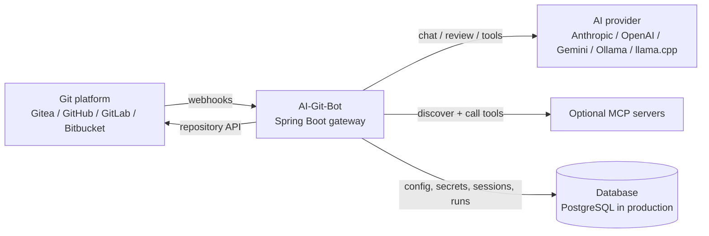
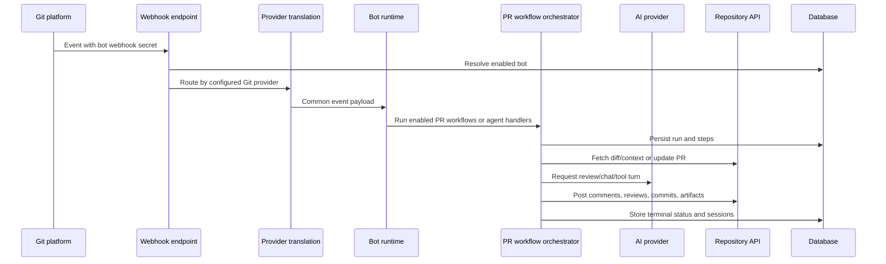

# Architecture — AI-Git-Bot

AI-Git-Bot is a self-hostable Spring Boot gateway between Git platforms and AI
providers. Operators configure one or more bots, connect each bot to a Git
integration and an AI integration, and expose a webhook URL to the Git platform.
The application then turns repository events into AI-assisted pull-request
reviews, coding-agent runs, writer-agent runs, unit-test workflows, and E2E-test
workflows.

This document is intentionally top-level. It describes the seams and runtime
flows that developers need to keep in mind without cataloguing classes, packages,
entity fields, or implementation methods.

## Design goals

- **Decouple Git hosts from AI providers.** A bot can pair a supported Git
  platform with a supported model provider without the workflow code depending
  on either concrete API.
- **Centralize operations.** Webhook routing, bot configuration, prompt
  selection, credentials, run history, sessions, and tool selection live in one
  gateway.
- **Support self-hosting.** PostgreSQL is the production database, H2 is used for
  local/test scenarios, and Flyway owns schema migrations for both vendors.
- **Keep workflows pluggable.** Pull-request automation is organized around a
  small `PrWorkflow` SPI, so new PR workflows can be added without rewriting
  webhook translation or provider clients.
- **Control tool access.** Built-in tools and remote MCP tools are discovered,
  filtered, and exposed per bot/configuration instead of being globally
  available to every model call.

## System overview

At runtime the gateway has four major boundaries:

1. **Inbound webhooks** from Git providers.
2. **Outbound repository API calls** through `RepositoryApiClient`.
3. **Outbound AI calls** through `AiClient`.
4. **Optional tool calls** to built-in tools and remote MCP servers.

The code inside the gateway should prefer these boundaries over provider-specific
logic. Provider-specific behavior belongs at the edge where payloads are
translated or API calls are made.

## Core concepts

### Bot

A bot is the operator-facing unit of configuration. It binds together:

- a Git integration and webhook secret,
- an AI integration and prompt/model choices,
- enabled PR workflows and workflow parameters,
- optional tool and MCP configuration,
- access-control settings such as allowed users,
- feature mode: coding bot or writer bot.

Multiple bots can run in the same deployment. They may share an integration, use
different model providers, or target different repositories.

### Git integration seam

The repository seam is centered on `RepositoryApiClient`. Workflow and agent code
uses it for provider-neutral operations such as fetching pull-request diffs,
reading repository content, posting comments/reviews, creating branches/files,
opening pull requests, attaching artifacts, and dispatching provider-native CI
workflows where supported.

Provider metadata creates configured clients from persisted Git integrations and
keeps authentication and URL conventions provider-specific. The current
provider types are Gitea, GitHub, GitLab, and Bitbucket Cloud.

Webhook handlers are the other side of this seam. Each provider has its own event
shape and headers, so provider-specific webhook code translates events into the
common payload model used by the rest of the application.

### AI integration seam

The AI seam is centered on `AiClient`. Higher-level code asks for reviews,
chat turns, or tool-capable chat without knowing whether the request goes to a
cloud API or a local model endpoint.

Provider metadata supplies defaults, API-key requirements, and client creation.
The current AI providers include Anthropic, OpenAI, Google Gemini, Ollama, and
llama.cpp. Some providers can use native tool calling; others fall back to a
textual protocol so agent workflows can still operate.

### PR workflow seam

Pull-request automation is organized around `PrWorkflow`. The orchestrator
chooses the workflows enabled for a bot, creates a persisted run record, invokes
workflows sequentially, captures step logs and errors, and prevents overlapping
runs for the same bot/repository/PR/workflow tuple.

Current workflow categories cover code review, agentic review, unit-test authoring,
and E2E testing. Workflows can expose configuration parameters and can be invoked
from normal PR events or from bot-mention slash commands where applicable.

### Deployment strategy seam

E2E workflows may need a preview environment before tests can run. That concern
is isolated behind `DeploymentStrategy`. A deployment target can represent a
static preview URL, an outbound webhook to another system, a provider-native CI
run, or an MCP-backed deployment tool. Strategies return enough persisted state
for later polling, callback handling, and teardown when a PR closes.

## Webhook-to-workflow flow

The endpoint is intentionally provider-neutral: the webhook secret identifies the
bot, and the bot's Git integration decides which provider translator receives the
payload. After translation, the rest of the system works with a common event
model.

Typical routing decisions are:

- pull-request open/update events run the bot's enabled PR workflows;
- PR comments mentioning the bot are treated as interactive commands or review
  follow-ups;
- inline review comments and submitted reviews are routed to review-context
  handling when the review workflow is enabled;
- issue assignment and issue comments route to the coding agent or writer agent,
  depending on bot type;
- PR close events clean up review state and E2E preview resources.

Access control is checked before expensive work. Bots can allow everyone or
restrict interactions to configured users, with PR-author handling for PR
comment flows.

## Persistence and secrets

The database stores durable configuration and run state rather than transient
implementation objects. Important categories include:

- admin users and setup state;
- Git integrations, AI integrations, bots, prompts, and workflow selections;
- MCP configurations and selected-tool whitelists;
- review and agent conversation/session state;
- PR workflow runs, step logs, deployment handles, and test-suite artifacts.

Production deployments use PostgreSQL via the Docker profile. Local development
uses file-backed H2 by default. Flyway migrations are split by database vendor
under `src/main/resources/db/migration/` and JPA validates the resulting schema.

Sensitive integration values are encrypted with AES-GCM when
`APP_ENCRYPTION_KEY` is configured. Without that key, credentials are stored in
plain text for development convenience; production deployments should always set
it and preserve it across restarts so existing secrets remain decryptable.

## MCP and tool integration

AI-Git-Bot exposes tools to agents through two channels:

- **Built-in tools** for repository inspection/editing, validation, artifacts,
  and workflow-specific operations.
- **Remote MCP tools** discovered from operator-configured MCP servers.

MCP configuration is persisted centrally. The gateway discovers server tools,
qualifies tool names to avoid collisions, caches catalogs, and filters exposure
through selected-tool whitelists. Tool output is bounded before it is returned to
agent loops so remote tools cannot flood prompts with unbounded content.

The model-facing tool protocol depends on provider capability. Native tool
calling is used when the selected AI client supports it; otherwise the agent
prompts use a textual tool-call protocol.

## PR workflow orchestration

A PR workflow run is the durable unit of PR automation. The orchestrator records
when a run starts, appends human-readable step logs, translates workflow results
into terminal statuses, and marks superseded in-flight runs as cancelled. This
allows operators and developers to reason about what happened even when webhooks
arrive concurrently or a provider retries delivery.

Review workflows gather the PR diff and repository context, send it to the
configured model, and post the result back to the PR. Interactive review handling
uses stored conversation context so follow-up comments can be answered with the
history of the PR discussion.

Agent workflows operate at issue or PR scope. The coding agent plans changes,
uses repository/tool context, edits through provider APIs, validates where
configured, and opens or updates a pull request. The writer agent focuses on
turning vague issues into clearer implementation-ready issues rather than
modifying code directly.

Unit-test and E2E workflows are PR-scoped. Unit-test workflows generate and rerun
white-box tests on command. E2E workflows can create or reuse preview deployments,
plan browser-style test cases, execute them through tools, attach artifacts, and
tear down preview resources when appropriate.

## Operational mental model

For most changes, ask which boundary you are touching:

- A new Git host usually means adding provider metadata, a repository client, and
  webhook translation while keeping workflows unchanged.
- A new AI provider usually means adding provider metadata and an `AiClient`
  implementation while keeping Git and workflow code unchanged.
- A new PR automation behavior should normally be a `PrWorkflow`, not a new
  webhook path.
- A new way to provision previews should be a `DeploymentStrategy`, not E2E
  workflow special cases.
- A new external capability should be a built-in tool or MCP tool with explicit
  selection/whitelisting.

## Where to go deeper

- Local setup, profiles, and developer commands: [LOCAL_DEVELOPMENT.md](LOCAL_DEVELOPMENT.md)
- Source entry points: `src/main/java/org/remus/giteabot/`
- Database migrations: `src/main/resources/db/migration/`
- Prompt files and agent schemas: `src/main/resources/prompts/` and
  `src/main/resources/agent/schemas/`
