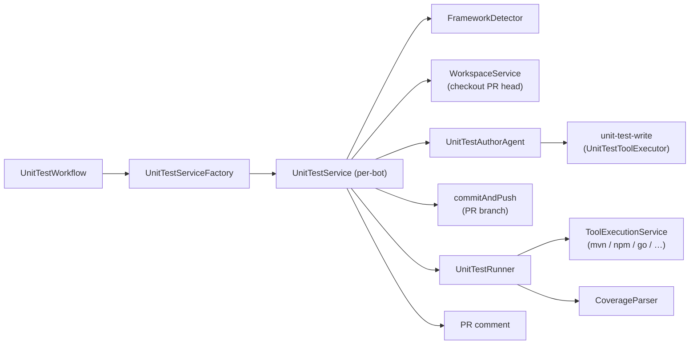
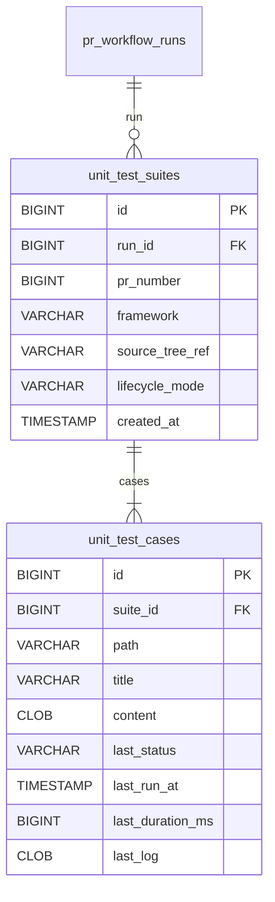

# Unit-Test Author Workflow

> Workflow key: **`unit-test-author`** · Category: **TESTING** ·
> Persona: developer / tech-lead · Deployment target: **none** ·
> Opt-in per bot via the workflow-selection UI.

The **Unit-Test Author** workflow generates focused **white-box unit tests**
for the change in a pull request, runs them with the project's *own* test
runner, commits the new tests onto the PR branch and posts a result + coverage
comment.

It reuses the **coding-agent infrastructure** (`WorkspaceService` checkout +
`commitAndPush`, the agent `ToolCatalog`) for the file-writing parts and runs
the project's build/test tool through the **same execution mechanism the coding
agent uses** (`ToolExecutionService`), so tool allow-listing and timeouts are
configured in exactly one place.

## How it differs from `e2e-test`

Both workflows live in category `TESTING`, but they solve different problems:

| Aspect | `e2e-test` | `unit-test-author` |
|---|---|---|
| Workspace | empty sandbox, no repo source | **full checkout of the PR head branch** (real source) |
| Needs a preview env / deployment target | yes | **no** |
| Browser | yes (Playwright) | **no** |
| Test kind | black-box journeys via a preview URL | **white-box unit tests** next to existing tests |
| Runner | `npx playwright test`, … | the project's own runner (`mvn test`, `npm test`, `pytest`, `go test`, …) |
| Side effect | optional follow-up PR / commit | **commits the generated tests onto the PR branch** + PR comment |

## Write-safety model

The author agent **can only add test files** — production code is never
touched. Three independent layers enforce this:

1. **Tool surface** — the author agent advertises a single write tool,
   `unit-test-write`. No general `patch-file` / `delete-file` / build tool is
   offered to this stage.
2. **Sandbox + test-directory guard** — `UnitTestToolExecutor` rejects any
   path that escapes the checkout (absolute paths, `..` traversal, symlinks)
   **and** any path that is not under the resolved framework's conventional
   test source directory (e.g. `src/test/` for Maven/Gradle, `tests/` for
   pytest, `*_test.go` for Go).
3. **Workflow side-effects** — only the PR's own branch is pushed, and the
   commit is created **before** the test run so build artefacts can never
   pollute it.

## Flow

1. Resolve params and the **framework** (auto-detected from repo marker files
   when left on `auto`).
2. Fetch the PR diff; skip cleanly when there is no diff or no supported
   toolchain is detected.
3. Clone the **PR head branch** into a workspace (real, writable source).
4. Persist a draft `unit_test_suites` row.
5. **Author agent** writes one test file per `unit-test-write` call, persisting
   a `unit_test_cases` row each, then replies `DONE`.
6. When the lifecycle is `commit-to-pr`, **commit & push** the new test files
   onto the PR branch.
7. **Run** the suite with the project's own runner via `ToolExecutionService`
   (one optional retry on failure when `maxRetries > 0`); parse a best-effort
   coverage snapshot.
8. Post a single PR comment with the per-file table, the run outcome and the
   coverage figure, then clean up the workspace.

## Supported toolchains

The **framework** parameter is auto-detected from marker files by default, or
can be pinned explicitly. Each toolchain's run command starts with a tool that
must be on the agent's `agent.validation.available-tools` allow-list (and
installed in the image):

| Framework | Auto-detect marker | Run command | Coverage parsed by `CoverageParser` |
|---|---|---|---|
| `maven`  | `pom.xml` | `mvn -q -B test` | JaCoCo `target/site/jacoco/jacoco.xml` |
| `gradle` | `build.gradle(.kts)` | `gradle test --quiet` | JaCoCo `build/reports/jacoco/test/jacocoTestReport.xml` |
| `npm`    | `package.json` | `npm test --silent` | `coverage/lcov.info` |
| `pytest` | `pyproject.toml` / `pytest.ini` / `setup.py` / `tox.ini` | `python3 -m pytest -q` | Cobertura `coverage.xml` |
| `go`     | `go.mod` | `go test ./... -count=1` | `coverage: NN.N% of statements` (stdout) |
| `cargo`  | `Cargo.toml` | `cargo test --quiet` | — (reported as unknown) |
| `dotnet` | `*.csproj` / `*.sln` | `dotnet test --nologo --verbosity quiet` | Cobertura `coverage.cobertura.xml` |
| `bundle` | `Gemfile` | `bundle exec rake test` | — (reported as unknown) |
| `make`   | `Makefile` | `make test` | `coverage/lcov.info` |
| `gcc`    | `Makefile` + `*.c` | `make test` | `coverage/lcov.info` |
| `g++`    | `Makefile` + `*.cpp` | `make test` | `coverage/lcov.info` |

> **C / C++ note.** Because there is no shell-free one-shot
> "compile + link + run" command, C (`gcc`) and C++ (`g++`) suites are driven
> through the project's `Makefile` (`make test`). The distinct framework lets
> auto-detection and the author agent treat the project as C vs C++.

Coverage is **best-effort**: a missing or unparseable report never fails the
workflow — the comment simply omits the coverage line.

## Parameters

Rendered automatically in the workflow-selection form from
`UnitTestWorkflow.paramsSchema()`:

| Key | Type | Default | Description |
|---|---|---|---|
| `framework` | enum | `auto` | Build/test toolchain. `auto` detects it from the repository; otherwise one of the keys in the table above. |
| `maxRetries` | integer | `1` | How many times to re-run a failing suite before reporting it failed (0–5). |
| `maxTestCases` | integer | `10` | Cost guard on the number of generated test files. Hard-capped at `50`. |
| `suiteLifecycle` | enum | `commit-to-pr` | `commit-to-pr` commits the generated tests onto the PR branch; `ephemeral` runs and reports them without committing. |

## System prompt

The author agent's role description is the operator-editable **Unit-Test Author
System-Prompt** on the *System settings → System prompts* page (entity column
`system_prompts.unit_test_author_system_prompt`, seeded by Flyway migration
`V23`). A non-editable protocol suffix — pinning the active framework, the
allowed test directories and the `unit-test-write` tool contract — is appended
at runtime by `UnitTestPromptLibrary`, and the tool-call protocol is appended
by `SystemPromptAssembler`, so editing the prompt cannot break tool calling.

## Triggers

* **PR opened / synchronized** — automatic, because `UnitTestWorkflow` is a
  `PrWorkflow` bean enumerated by `PrWorkflowRegistry` and run by
  `PrWorkflowOrchestrator` whenever it is enabled on the bot's workflow
  configuration.
* **Slash commands** (`UnitTestSlashCommandHandler`, mirrors the e2e handler —
  👀 reaction, PR hydration, enabled-check before dispatch):
  * `@bot generate-tests` — (re)generate and run the suite for the PR.
  * `@bot rerun-unit-tests` — re-trigger the workflow on the current head.

## Enabling it

1. Open *System settings → Workflow configurations → Workflows* for the
   relevant configuration.
2. Tick **AI Unit Tests** and (optionally) adjust its parameters.
3. Assign that workflow configuration to the bot.

Because the orchestrator only runs explicitly-selected non-`REVIEW` workflows,
the unit-test author never runs unless an operator enables it — it does not
replace or duplicate the standard `review` or `e2e-test` workflows.

## Provider support

Native function calling is used when the bot's AI integration supports it
(`AiClient.supportsNativeTools()`). When the model emits the `unit-test-write`
call as narrated plain text instead of a native `tool_use` block, the agent
recovers it via `NarratedToolCallParser` — the same fallback the E2E author
agent uses.

## Persistence

Two tables, created by Flyway migration `V24` (H2 + PostgreSQL):

A `unit_test_suites` row groups every generated test file for one workflow run
on one PR; each `unit_test_cases` row keeps the full file content plus its last
execution outcome. They mirror the e2e `pr_test_suites` / `pr_test_cases`
tables but for white-box unit tests.

## See also

- [PR Workflows guide](PR_WORKFLOWS.md) — orchestrator, configurations, lifecycle
- [Agentic PR Review](PR_WORKFLOWS_AGENTIC_REVIEW.md) — the read-only agentic sibling
- [E2E full-stack QA](PR_WORKFLOWS_E2E.md) — the black-box testing workflow
- [AGENT.md](AGENT.md) — the coding-agent infrastructure reused here

