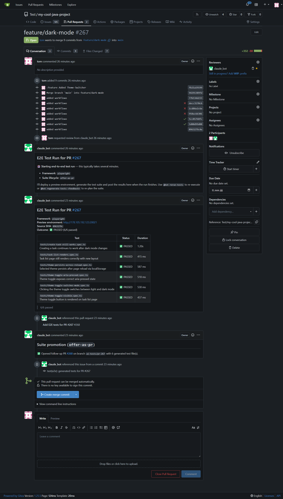

# Using AI-Git-Bot from your Git platform

This guide is for developers whose team administrator already connected
AI-Git-Bot to Gitea, GitHub, GitLab, or Bitbucket Cloud.

You do not need access to the bot's admin UI. You use the bot from the
same pull requests, merge requests, issues, and comments you already use
for code review.

> In examples below, replace `@bot` with your team's actual bot account,
> for example `@ai-reviewer`.

## What you can ask the bot to do

| Need | How you trigger it | What appears in Git |
|---|---|---|
| PR review | Add the bot as reviewer, or re-request its review | Inline findings and a summary comment |
| Follow-up Q&A | Mention the bot in a PR comment or inline review thread | A threaded reply with PR context |
| Re-run E2E tests | Comment `@bot rerun-tests` | A new Full-stack QA run report |
| Regenerate E2E tests | Comment `@bot regenerate-tests <feedback>` | A new planned/generated E2E suite |
| Generate unit tests | Comment `@bot generate-tests` | Unit-test files on the PR branch and a report |
| Re-run unit-test authoring | Comment `@bot rerun-unit-tests` | A regenerated/re-run unit-test report |
| Implement an issue | Assign the issue to a coding bot | A branch and pull request |
| Improve an issue | Assign the issue to a writer bot | A linked `AI Created Issue: ...` |

## Getting a pull request reviewed

Use the normal reviewer controls in your Git platform:

1. Open a pull request or merge request.
2. Add the bot account as a reviewer.
3. Wait for the bot to post its review.
4. If you push more commits and want another pass, re-request the bot's review.

The review bot reads the PR diff and posts feedback in the PR. Depending on
your provider and bot configuration, comments may appear inline on changed
lines and/or as a summary review comment.

Large diffs are handled in chunks. If the bot misses context that matters,
ask a follow-up question in the PR instead of opening a separate chat.

<details>
<summary>Examples across Git platforms</summary>

**Gitea review:**


**GitHub review conversation:**


**GitLab merge request review:**


**Bitbucket review:**


</details>

## Talking to the bot in a PR

Mention the bot in a PR comment when you want an explanation, a second
opinion, or a focused follow-up:

```text
@bot why is this null check necessary?
```

You can also mention the bot in an inline review comment thread:

```text
@bot can you explain the risk on this line and suggest a safer alternative?
```

The bot replies in the Git platform thread. It can use the PR diff, file
context, and prior session history for that PR, so keep the conversation in
the PR where possible.

Avoid sharing secrets, credentials, or private data in comments. Treat bot
comments like normal PR discussion visible to everyone with repository access.

<details>
<summary>Inline conversation example</summary>


</details>

## Slash commands in PR comments

Slash commands are normal PR comments that start with a bot mention. They
only work when your administrator enabled the matching workflow for that bot.
If a workflow is not enabled, the command may be ignored or the bot may reply
with the commands available for that PR.

### Full-stack QA / E2E commands

| Command | What it does | When to use it |
|---|---|---|
| `@bot rerun-tests` | Re-runs the most recent E2E test suite for the PR. It reuses existing generated tests and does not ask the LLM to plan new ones. | Use after fixing the app, recovering a preview environment, or retrying suspected flakiness. |
| `@bot regenerate-tests <feedback>` | Runs the full E2E planning, authoring, and execution flow again. Text after the command is passed as feedback to the planner. | Use when generated tests missed a case or made wrong assumptions. |

Examples:

```text
@bot rerun-tests
```

```text
@bot regenerate-tests use data-testid selectors and also cover the empty state
```

### Unit-test author commands

| Command | What it does | When to use it |
|---|---|---|
| `@bot generate-tests` | Generates white-box unit tests for the PR diff, runs them with the project's own test runner, and usually commits test files to the PR branch. | Use when the PR needs targeted unit-test coverage. |
| `@bot rerun-unit-tests` | Regenerates and re-runs the unit-test author workflow for the PR. | Use after changes to the PR or when the first generated suite was not useful. |

Examples:

```text
@bot generate-tests
```

```text
@bot rerun-unit-tests
```

## Assigning an issue to a coding bot

If your team has a coding bot, assigning an issue to that bot asks it to
implement the issue.

1. Create or choose an implementation-ready issue.
2. Make sure the issue describes the desired behavior, constraints, and any
   acceptance criteria your team expects.
3. Assign the issue to the coding bot account.
4. Watch the issue comments for progress, validation failures, and the final
   pull request link.

The coding bot works in a branch, validates with the repository's normal
build or test tools when it can, then opens a PR for human review.

Avoid assigning vague or high-risk issues directly to a coding bot. If the
issue is not actionable yet, use a writer bot first.

<details>
<summary>Coding-agent examples</summary>

**GitHub issue assigned to a coding bot:**


**GitLab issue assigned to a coding bot:**


</details>

## Assigning an issue to a writer bot

A writer bot improves an unclear issue. It does not implement code. It reads
the issue, looks for relevant repository and issue context, and either asks
minimal clarifying questions or creates a better follow-up issue.

1. Create or find a vague, incomplete, or hard-to-test issue.
2. Assign the issue to the writer bot account.
3. If the bot asks clarifying questions, the original issue author should
   answer in the issue comments.
4. When enough information is available, the bot creates a linked issue titled
   `AI Created Issue: <original title>`.

Use the writer bot when an issue needs:

- a clearer problem statement,
- reproduction steps,
- acceptance criteria,
- testability notes,
- scope boundaries,
- fewer ambiguous requirements.

Writer bots are for issue-assignment workflows on providers that support them
(Gitea, GitHub, and GitLab). Bitbucket Cloud is PR-review only.

## What the unit-test workflow posts on your PR

When AI Unit Tests are enabled, the bot can run automatically on PR events or
via `@bot generate-tests`.

From a PR author's perspective, the bot:

1. reads the PR diff,
2. detects the project's test toolchain where possible,
3. writes focused test files in valid test locations,
4. runs the project test command,
5. posts a PR comment with generated files, pass/fail status, and best-effort
   coverage information,
6. may commit the generated test files to the PR branch, depending on the
   workflow lifecycle chosen by your administrator.

The unit-test author is designed for white-box tests near the code under
review. It should not modify production source files.

## What Full-stack QA / E2E posts on your PR

When Full-stack QA is enabled, the bot tests the PR through a preview
environment. The exact deployment is configured by your administrator, but the
PR experience is consistent:

1. the bot plans user journeys affected by the PR,
2. a preview environment is requested or located,
3. the bot generates runnable E2E tests, usually Playwright,
4. it runs the suite against the preview URL,
5. it posts a Markdown report on the PR.

A typical report includes:

- framework name,
- preview URL,
- source commit SHA,
- overall outcome,
- a table of tests with status and duration,
- artifact links or inline details when the provider supports them.



Generated E2E tests may be kept only for that PR, committed to the PR branch,
offered as a follow-up PR, or promoted after merge. Your administrator chooses
that lifecycle. Treat generated tests like any other contribution: review them
before relying on them as a long-term regression baseline.

## Practical tips

- Use normal Git review controls first: request review, push fixes, re-request.
- Keep bot Q&A in the PR so the bot has the right context.
- Give concrete feedback when regenerating tests.
- Prefer writer bots for vague work and coding bots for implementation-ready work.
- Review generated code and tests before merging.
- If something looks wrong, include the provider, workflow, PR/issue link, and
  relevant bot comment when reporting it to your administrator.
