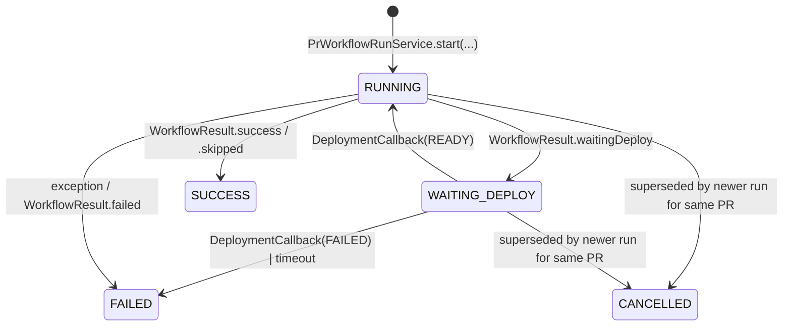

# Agentic PR Workflows — Internals &amp; Component Reference

Companion to [`CONCEPT_AND_ARCHITECTURE.md`](./CONCEPT_AND_ARCHITECTURE.md).
This document is the *how it's wired up in code* view: package layout,
SPI shapes, Spring beans, persistence schema, extension points, and the
cross-cutting conventions every part of the subsystem follows.

> If you are looking for the *operator-facing* recipes, see
> [`../PR_WORKFLOWS.md`](../PR_WORKFLOWS.md) (workflow configurations +
> deployment targets) and
> [`../PR_WORKFLOWS_E2E.md`](../PR_WORKFLOWS_E2E.md) (the `e2e-test`
> workflow). For the *why*, see
> [`CONCEPT_AND_ARCHITECTURE.md`](./CONCEPT_AND_ARCHITECTURE.md).

---

## Conventions

| Aspect | Rule |
|---|---|
| Package root | `org.remus.giteabot.prworkflow` (orchestrator, registry, services). Strategies live under `org.remus.giteabot.prworkflow.deployment.*`; the E2E workflow under `org.remus.giteabot.prworkflow.e2e.*`. |
| Persistence | Flyway migrations under `src/main/resources/db/migration/`, mirrored for H2 + PostgreSQL. |
| Encryption  | Every secret column (webhook secrets, deployment-target tokens, callback secrets) is persisted encrypted via `EncryptionService` whenever `APP_ENCRYPTION_KEY` is configured. |
| Backwards compatibility | Every new column on `bots` is **nullable**. A bot without a `WorkflowConfiguration` keeps running the legacy `review` workflow only. |
| Tests | Per service: unit tests under `src/test/java/...`. Per controller: MockMvc tests mirroring `AdminControllerTest`. Strategy and per-provider clients additionally use WireMock fixtures. |
| Feature flags | Workflows ship behind `prworkflow.<name>.enabled` properties (`review` defaults to `true`; everything else defaults to `false` and is enabled by the operator via the admin UI). |
| Telemetry | Micrometer counter `prworkflow.run_total{workflow,status}` and timer `prworkflow.run_duration_seconds{workflow}`, exposed at `/actuator/prometheus`. |

---

## Components

### Orchestration layer

| Class | Role |
|---|---|
| `PrWorkflow` (interface) | SPI implemented by every workflow. Methods: `key()`, `displayName()`, `category()`, `paramsSchema()`, `run(PrWorkflowContext)`, optional `supportsCallback()` / `onCallback(...)`. |
| `PrWorkflowRegistry` (`@Service`) | Auto-discovers all `PrWorkflow` Spring beans, validates unique kebab-case keys, exposes lookup by key. Mirrors `AiProviderRegistry`. |
| `PrWorkflowOrchestrator` (`@Service`) | Single entry point from `BotWebhookService`. Resolves the bot's `WorkflowConfiguration`, persists `PrWorkflowRun` rows, catches workflow exceptions, emits metrics. Concurrency: per `(botId, repoOwner, repoName, prNumber, workflowKey)` only one `RUNNING` / `WAITING_DEPLOY` row at a time; on PR-synchronize, the previous run is `CANCELLED`. |
| `PrWorkflowContext` (record) | Immutable per-run state handed to `run(...)`: bot, payload, run id, append-step callback, allowed built-in tools, MCP catalog, deployment target (nullable), workflow params (JSON), operator `hints` (e.g. feedback from `@bot regenerate-tests`). |
| `WorkflowResult` | Outcome (`SUCCESS` / `FAILED` / `SKIPPED` / `WAITING_DEPLOY`) + short human-readable summary + optional artifact list. |
| `PrWorkflowRunService` | CRUD + lifecycle for runs and steps: `start()`, `appendStep()`, `complete()`, `fail()`, `cancel()`. |
| `PrWorkflowMetrics` | Owns the Micrometer meters listed in *Conventions*. |

### Built-in workflows

| Class | Key | Notes |
|---|---|---|
| `ReviewWorkflow` (under `org.remus.giteabot.prworkflow.review`) | `review` | The classic PR-review path extracted 1:1 from the pre-1.7 `BotWebhookService.reviewPullRequest(...)`. Always enabled on the `Default` workflow configuration. |
| `E2ETestWorkflow` (under `org.remus.giteabot.prworkflow.e2e`) | `e2e-test` | Plans → deploys → authors → runs → reports. Opt-in via the seeded `Full-stack QA` workflow configuration. See *E2E sub-system* below. |

### Workflow configurations

| Class | Role |
|---|---|
| `WorkflowConfiguration` / `WorkflowSelection` (JPA, package `…prworkflow.config`) | Reusable, named whitelist of workflow keys + per-key `params_json`. A bot picks at most one configuration via the nullable `bots.workflow_configuration_id` FK. |
| `WorkflowConfigurationService` | CRUD + clone; guards the `defaultEntry` (cannot be renamed, deleted, or lose its flag) and blocks deletion while bots still reference the configuration. |
| `WorkflowSelectionService` | Add/remove/update selections; validates `params_json` against the workflow's `paramsSchema()` via `WorkflowParamsValidator`; exposes deterministic ordering via `enabledWorkflowKeys(configurationId)`. |
| `DefaultWorkflowConfigurationInitializer` (`ApplicationRunner`) | Idempotently ensures the seeded `Default` configuration exists, additively enables newly-registered `REVIEW`-category workflows, and backfills bots whose FK is still null. Workflows in other categories are **never** auto-enabled — the operator must opt in. |

### Deployment layer

| Class | Role |
|---|---|
| `DeploymentStrategy` (interface, `org.remus.giteabot.prworkflow.deployment`) | SPI: `typeKey()`, `configSchema()`, `trigger(req)`, `poll(handle)`, `teardown(handle)`, `awaitsCallback()`. |
| `DeploymentRequest` / `DeploymentHandle` / `DeploymentStatus` | DTOs threading PR metadata + per-run callback URL/secret through the strategy. |
| `WebhookTriggerStrategy` | POSTs an HMAC-signed JSON envelope to the configured URL; `awaitsCallback() == true`. |
| `StaticPreviewUrlStrategy` | Resolves a URL template (`{prNumber}` / `{sha}` / `{branch}` / `{branchSlug}` / `{repoOwner}` / `{repoName}`) and optionally probes `…/{healthcheckPath}` until 2xx; `awaitsCallback() == false`. |
| `MCPDeploymentStrategy` (`…deployment.mcp`) | Calls `deployTool` / `statusTool` / `teardownTool` through `McpOrchestrationService.executeTool(...)`; save-time **and** runtime whitelist enforcement via `McpToolSelectionService.selectedQualifiedToolNameSet(...)`. `awaitsCallback() == false`. |
| `CiActionTriggerStrategy` + `CiActionPoller` | Dispatches the Git host's native CI through three SPI methods on `RepositoryApiClient` (`dispatchWorkflow`, `getWorkflowRun`, `getWorkflowRunOutputs`); the scheduled poller drives the run forward and publishes a `CallbackResult` via `DeploymentCallbackNotifier`. `awaitsCallback() == true` (callback synthesised by the poller). |
| `DeploymentTargetService` | CRUD + per-strategy `configJson` validation; secrets encrypted at rest. |
| `WorkflowCallbackController` | Exposes `POST /api/workflow-callback/{runId}/{secret}` and `POST /api/workflow-log/{runId}/{secret}`; HMAC verification using the per-run `callback_secret`; rejects callbacks against runs already in a terminal state with HTTP 409. |
| `DeploymentCallbackNotifier` | In-process `SynchronousQueue` keyed by run id — used by the callback controller and the CI poller to wake the orchestrator thread waiting on `WAITING_DEPLOY`. |

### E2E sub-system (the `e2e-test` workflow)

| Class | Role |
|---|---|
| `PrTestWorkspaceManager` | Allocates `${java.io.tmpdir}/ai-bot-pr-tests/run-<id>/`; minimal per-framework scaffolding (Playwright by default); path-traversal guards mirror `WorkspaceFileTools`. |
| `PrTestSuiteRepository` / `PrTestCaseRepository` | JPA repositories backing the per-PR suites (tables `pr_test_suites`, `pr_test_cases`). |
| Built-in tools under `org.remus.giteabot.agent.tools.prworkflow` (category `PR_WORKFLOW`) | `pr-test-write(path, content)`, `pr-test-run(framework, args[])`, `preview-url()`, `preview-status()`, `attach-artifact(path)`. Opt-in via `BotToolConfiguration` (disabled on `Default`, enabled on `Full-stack QA`). |
| `ArtifactCommentRenderer` + `RepositoryApiClient.attachPullRequestArtifact` | Provider-agnostic artifact upload: per-provider native overrides (GitLab `/uploads`, Gitea issue assets, Bitbucket downloads), GitHub falls back to the inline renderer. Shared helper: `ArtifactUploadSupport`. |
| `TestPlannerAgent`, `TestAuthorAgent`, `TestRunnerAgent` (`…prworkflow.e2e.agents`) | Three cooperating agents over a dedicated lightweight `E2eAgentRunner` (slim `chatWithTools` loop). They reuse provider-native tool calling and the shared `AgentToolRouter`. |
| `E2ePromptLibrary` + `TestPlan` / `TestPlanParser` | Prompt templates and a tolerant JSON parser with a cost cap (`agent.budget.*`). |
| `PlaywrightTestSuiteRunner` (default impl of `TestSuiteRunner`) | Orchestrates planner → author → runner, derives per-`PrTestCase` status from the runner's structured output. |
| `E2eTestSlashCommandHandler` | Wires `@bot rerun-tests` and `@bot regenerate-tests [feedback]` into all four provider webhook paths; feedback is threaded into `TestPlannerAgent.PlannerInput.feedback` via `PrWorkflowContext.hints`. |
| `E2eTestPrCloseHandler` | PR-close lifecycle hook: broadcasts `DeploymentStrategy.teardown(...)` per registered strategy and honours `SuiteLifecycleMode` for in-DB cleanup. |
| `SuitePromotionService` + `PromotedSuiteGarbageCollector` | Suite-promotion modes (`ephemeral` / `commit-to-pr` / `offer-as-pr` / `promote-on-merge`); nightly `@Scheduled` GC retires stale `PrTestSuite` rows once `PrWorkflowRun.finishedAt` is older than `prworkflow.e2e.promotion.retention` (default `P30D`), preserving the promoted-PR link on the run. |

---

## Persistence

All schema lives under `src/main/resources/db/migration/`, mirrored for
H2 (`h2/`) and PostgreSQL (`postgresql/`).

| Migration | Tables / columns | Subsystem |
|---|---|---|
| `V13__prworkflow_runs.sql` | `pr_workflow_runs`, `pr_workflow_steps` | Orchestrator core |
| `V14__workflow_configurations.sql` | `workflow_configurations`, `workflow_selections`, `bots.workflow_configuration_id` (nullable FK) | Workflow configurations |
| `V15__workflow_configurations_default.sql` | Idempotent `Default` seed + bot backfill | Workflow configurations |
| `V16__deployment_targets.sql` | `deployment_targets` (encrypted `config_json`), `bots.deployment_target_id` (nullable FK), `pr_workflow_runs.{preview_url, callback_secret, deployment_handle_json}` | Deployment targets |
| `V17__pr_test_suites.sql` | `pr_test_suites`, `pr_test_cases`, `pr_workflow_runs.follow_up_pr_number` | E2E sub-system + suite promotion |
| `V18__workflow_configurations_full_stack_qa.sql` | Idempotent `Full-stack QA` seed (not the default entry) | E2E opt-in |

`pr_workflow_steps.log_excerpt` is truncated to 8 KB; `pr_workflow_runs.summary`
to 2 000 characters — long-form output stays in the application log.

---

## Lifecycle state machine



There is intentionally no `QUEUED` intermediate state — the orchestrator
owns the transition from "webhook received" to "workflow executing"
inside a single synchronous call to `PrWorkflowRunService.start(...)`.

---

## Writing a new workflow

```java
@Component
public class SecurityScanWorkflow implements PrWorkflow {

    @Override public String key()                  { return "security-scan"; }
    @Override public String displayName()          { return "Security Scan"; }
    @Override public PrWorkflowCategory category() { return PrWorkflowCategory.SECURITY; }

    @Override
    public WorkflowResult run(PrWorkflowContext context) {
        context.appendStep("scan-start", "Running scan for PR #"
                + context.payload().getPullRequest().getNumber());
        // … do the work …
        return WorkflowResult.success("No issues found");
    }
}
```

That is enough — `PrWorkflowRegistry` picks the bean up via Spring DI.
Operators enable it on a `WorkflowConfiguration` to activate it on a
bot. Workflows whose `category() != REVIEW` are **never** auto-enabled
on the seeded `Default` configuration — they must be opted in
explicitly.

---

## Writing a new `DeploymentStrategy`

Implement the interface, expose the bean, declare its JSON config
schema, and add a form snippet under
`src/main/resources/templates/system-settings/deployment-targets/` for
the per-strategy fields. The strategy is exercised end-to-end by:

1. `DeploymentTargetService` (save-time validation),
2. `PrWorkflowOrchestrator` (calls `trigger(...)` when a workflow
   returns `WorkflowResult.waitingDeploy`),
3. either `WorkflowCallbackController` (`awaitsCallback() == true`) **or**
   a scheduled poller analogous to `CiActionPoller`
   (`awaitsCallback() == false`).

Reference unit tests: `WebhookTriggerStrategyTest`,
`StaticPreviewUrlStrategyTest`, `MCPDeploymentStrategyTest`,
`CiActionTriggerStrategyTest`, `CiActionPollerTest`.

---

## Cross-cutting concerns

| Topic | Where it lives |
|---|---|
| **Security review** | `WorkflowCallbackController` HMAC + per-run secret rotation; per-IP rate-limit on `/api/workflow-callback/*`; terminal-state replay guard. |
| **Permissions** | `WorkflowConfiguration` can be created by operators; `DeploymentTarget` creation is restricted to super-admins via the standard `AdminAuthorizationFilter`. |
| **Observability** | The two Micrometer meters listed in *Conventions* — consume via `/actuator/prometheus`. |
| **Docker image size** | Playwright is **not** bundled in the base image; recommended deployment is a sidecar container (see [`../../systemtest/docker-compose-e2e-sample.yml`](../../systemtest/docker-compose-e2e-sample.yml)). |
| **i18n** | All admin-UI strings flow through `messages_*.properties`. |
| **Migration guide** | Operator-facing notes for users upgrading from 1.6 → 1.7 live in [`../MIGRATION_1.6_TO_1.7.md`](../MIGRATION_1.6_TO_1.7.md). |

---

## Risk register (operational)

| Risk | Mitigation |
|---|---|
| Native tool calling differs subtly per AI provider when used by the three E2E agents | Reuse existing `AgentLoop` legacy fallback + `agent.use_legacy_tool_calling` toggle (see [AGENT.md](../AGENT.md)). |
| Playwright runtime not present in operator's runtime | Sidecar Docker Compose example under `systemtest/`; required system packages documented; MCP-based execution available as an alternative. |
| Callback endpoint scanning / abuse | HMAC + per-run secret (rotated, single-use post-terminal), per-IP rate-limit. |
| Long-running `WAITING_DEPLOY` runs blocking resources | Non-blocking waits: orchestrator returns after `trigger()`; callback / poller wakes work via a `TaskExecutor`. |
| Flyway H2 ↔ PostgreSQL divergence | Per-migration tests on both, mirroring `BotServiceTest` (H2) and the system tests under `systemtest/`. |
| Multi-instance deployment + in-process callback notifier | Documented in [`../PR_WORKFLOWS.md` § Multi-instance caveat](../PR_WORKFLOWS.md#multi-instance-caveat); recommendation: sticky load-balancer routing, or move the notifier to Redis pub/sub. |

