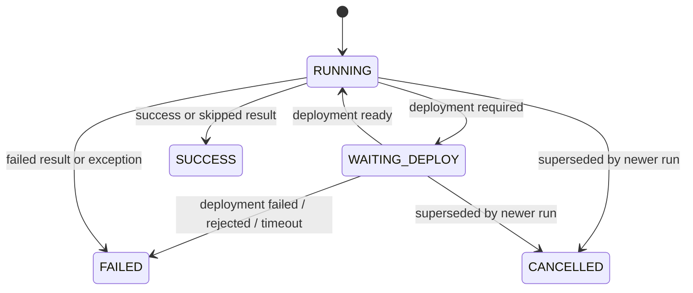

# Agentic PR Workflows — Developer Notes

This page is a short map for developers extending or debugging agentic
PR-workflows. The source code and tests are the authoritative reference.

## Source map

Feature code lives under `src/main/java/org/remus/giteabot/`.

Main package areas:

- `org.remus.giteabot.prworkflow` — workflow SPI, orchestration, run state, and shared result types.
- `org.remus.giteabot.prworkflow.config` — workflow configuration and deployment-target support.
- `org.remus.giteabot.prworkflow.deployment` and `.deployment.mcp` — strategies, callbacks, polling, and MCP deployment.
- `org.remus.giteabot.prworkflow.review` and `.agentreview` — PR review.
- `org.remus.giteabot.prworkflow.e2e` — Full-stack QA / E2E workflow, agents, runner, tools, workspace, and suite promotion packages.
- `org.remus.giteabot.prworkflow.unittest` — AI Unit Tests workflow, authoring, path guards, coverage, runner, and tools packages.

Tests live under matching `src/test/java/org/remus/giteabot/...` paths.
Database changes live under `src/main/resources/db/migration/`.

## Extension points

A PR workflow is a Spring-managed implementation of the workflow SPI: it has a
stable key, optional parameters, and a run method that returns a workflow
result. Spring DI discovers it; operators enable it before bots use it.

A deployment strategy is a Spring-managed implementation of the deployment
strategy SPI: it validates JSON config, starts or locates a preview
environment, reports readiness through polling or callbacks, and tears preview
resources down when supported.

Keep Git-host specifics behind the repository API layer and AI-provider
specifics behind the AI client/tool-calling layer.

## Workflow run states

There is no queued state; runs are inserted directly as `RUNNING`.
